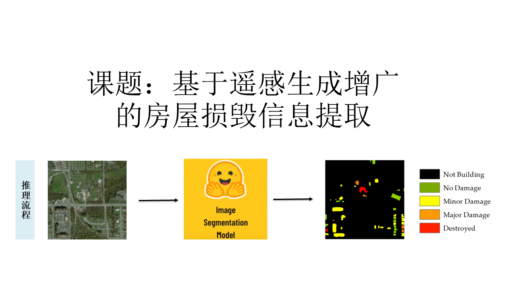
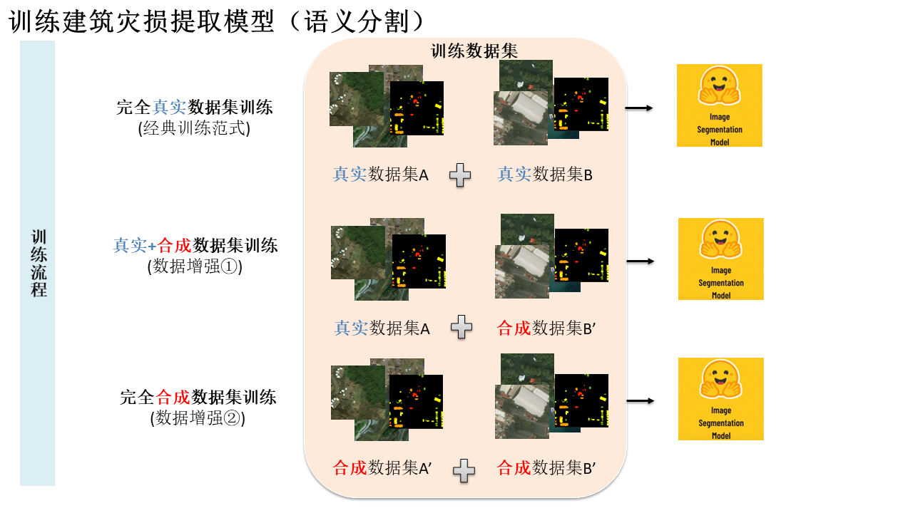
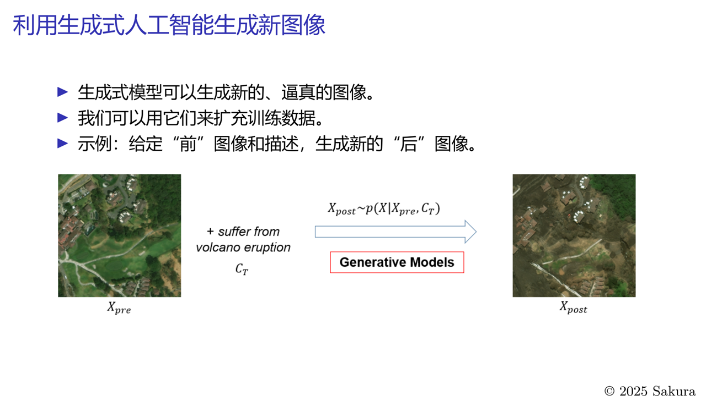

# ZJU-GISLAB-COURSE-2025-Data-Augmentation

<a href="https://bili-sakura.github.io/ZJU-GISLAB-COURSE-2025-Data-Augmentation/">
  
</a>

Remote Sensing Data Augmentation for Building Damage Extraction

> We have a naive try last year (2024 Summer) focusing on text-image-to-image generation, see [repo](https://github.com/Bili-Sakura/ZJU-GISLAB-COURSE-2024).





## Project Outline

- Dataset

  - Real Dataset: xBD ~22k bi-temporal pairs
  - Augment Dataset: 1x - 4x on Real Dataset (using Image Editing model)

Baseline: see xView2 official code at github.

## Others

Difference between `inpainting`, `conditional generation` and `multi-conditional genetation`:

```bibtex
@inproceedings{zhangAddingConditionalControl2023,
	title = {Adding {Conditional} {Control} to {Text}-to-{Image} {Diffusion} {Models}},
	url = {https://ieeexplore.ieee.org/document/10377881},
	doi = {10.1109/ICCV51070.2023.00355},
	urldate = {2024-06-25},
	booktitle = {2023 {IEEE}/{CVF} {International} {Conference} on {Computer} {Vision} ({ICCV})},
	author = {Zhang, Lvmin and Rao, Anyi and Agrawala, Maneesh},
	month = oct,
	year = {2023},
	keywords = {Computer vision, Training, Computer architecture, Image segmentation, Image coding, Neural networks, Image edge detection, ControlNet},
	pages = {3813--3824},
}


@inproceedings{rombachHighResolutionImageSynthesis2022,
	title = {High-{Resolution} {Image} {Synthesis} {With} {Latent} {Diffusion} {Models}},
	url = {https://openaccess.thecvf.com/content/CVPR2022/html/Rombach_High-Resolution_Image_Synthesis_With_Latent_Diffusion_Models_CVPR_2022_paper.html},
	language = {en},
	urldate = {2024-06-29},
  publisher={CVPR},
	author = {Rombach, Robin and Blattmann, Andreas and Lorenz, Dominik and Esser, Patrick and Ommer, Björn},
	year = {2022},
	keywords = {Stable Diffusion},
	pages = {10684--10695},
}

```

---

If you are going to load and process `.tiff` image files, following [here](https://www.kaggle.com/code/yassinealouini/working-with-tiff-files).

```python
# using rasterio

import rasterio
from torchvision.transforms import ToTensor

path = "sample.tiff"

with rasterio.open(path) as image:
    image_array = image.read()

torch_image = ToTensor()(image_array)
print(torch_image.shape)
```


