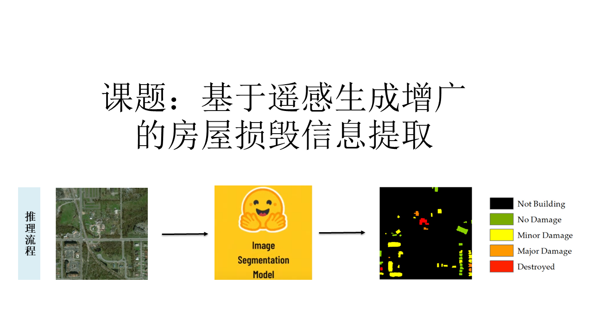
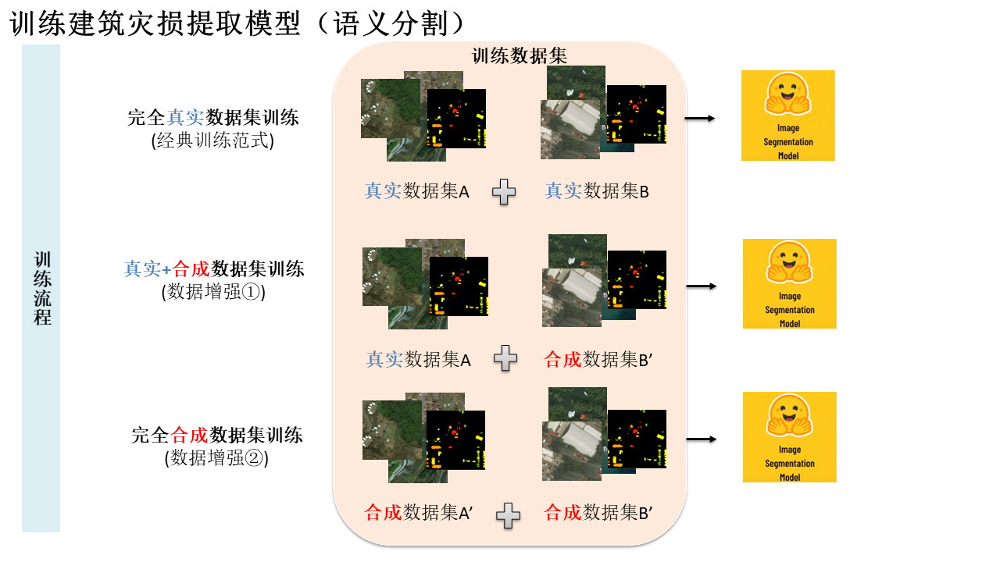
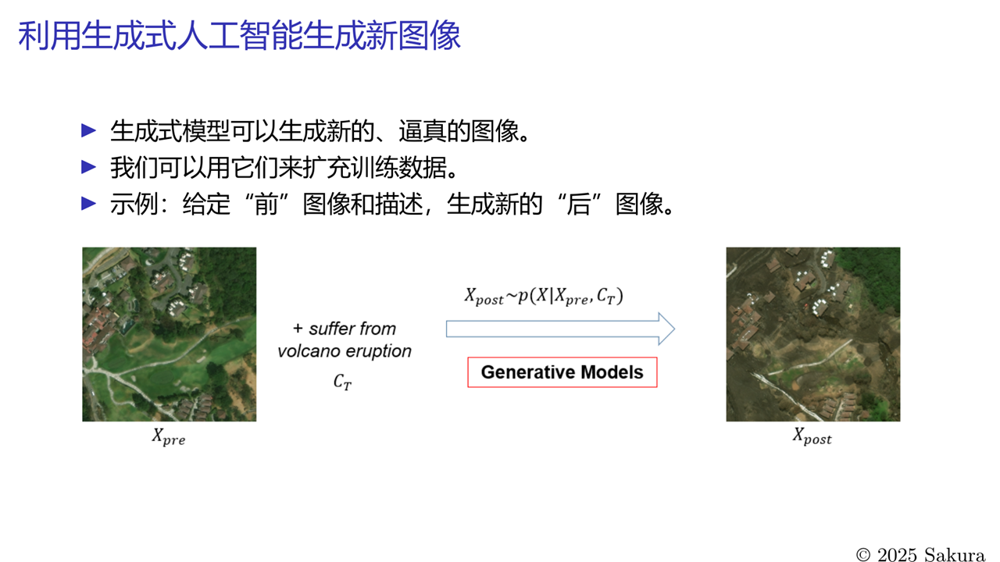

# ZJU-GISLAB-COURSE-2025-Data-Augmentation

Remote Sensing Data Augmentation for Building Damage Extraction

> We have a naive try last year (2024 Summer) focusing on text-image-to-image generation, see [repo](https://github.com/Bili-Sakura/ZJU-GISLAB-COURSE-2024).

## Project Outline

- Dataset

  - Real Dataset: xBD ~22k bi-temporal pairs
  - Augment Dataset: 1x - 4x on Real Dataset (using Image Editing model)

- Baseline Models (Open-Vocubulary Sementic Segmentation)
  - [CLIPSeg](https://github.com/timojl/clipseg) @CVPR'22 [(Paper)](https://openaccess.thecvf.com/content/CVPR2022/html/Luddecke_Image_Segmentation_Using_Text_and_Image_Prompts_CVPR_2022_paper.html)
  - [MaskCLIP](https://github.com/chongzhou96/MaskCLIP) @ECCV'2022 [(Paper)](https://www.ecva.net/papers/eccv_2022/papers_ECCV/papers/136880687.pdf)
  - [ClearCLIP](https://github.com/mc-lan/ClearCLIP) @ECCV'2024 [(Paper)](https://www.ecva.net/papers/eccv_2024/papers_ECCV/papers/06346.pdf)

> These baseline models are derived from paper of ['SegEarth-OV' (CVPR'2025 Oral)](https://openaccess.thecvf.com/content/CVPR2025/html/Li_SegEarth-OV_Towards_Training-Free_Open-Vocabulary_Segmentation_for_Remote_Sensing_Images_CVPR_2025_paper.html). You can view its GitHub [repo](https://github.com/likyoo/SegEarth-OV) to find exisitng inference and evaluation codes.
